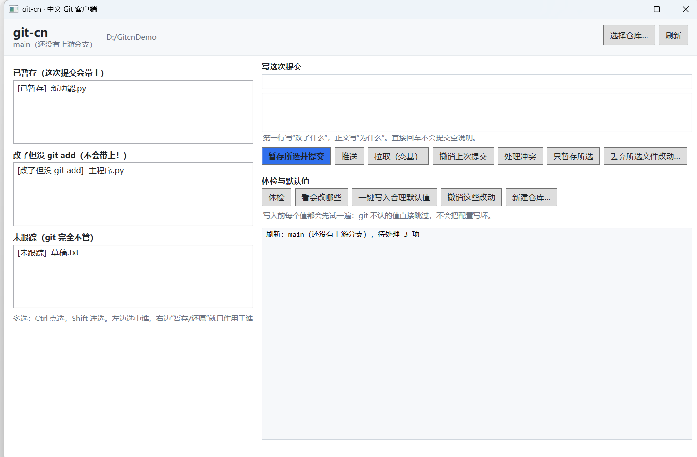

# git-cn：让 Git 说中文，也别说黑话

Git 的报错和默认行为是为"已经懂 Git 的人"设计的。对刚上手的人（或者只是偶尔提交一下的人）来说，它有三道墙：

1. **中文文件名显示成 `"\346\226\207\344\273\266"`**，提交信息一多就乱码；
2. **报错只告诉你"不行"，不告诉你"那怎么办"**——`Changes not staged for commit` 这种句子，翻译得再准也没用；
3. **一个命令能干两件相反的事**（`git checkout` 既切分支又丢改动），而丢掉的改动 Git 不给你留副本。

git-cn 把这三道墙拆了，而且**两条路都给你**：想直接用，装个 EXE / 命令行就行；想究根，这里有一份改过源码、能自己编译的 Git。



---

## 30 秒上手

**Windows（推荐，零依赖）**：到 [Releases](../../releases) 下载 `git-cn-gui-win-x64.zip`，解压双击 `git-cn-gui.exe`。不用装 Python，也不用装 .NET。

**命令行版**（Windows / Linux / macOS）：

```bash
git-cn doctor      # 先体检：git 版本、配置、编码、是不是汉化版
git-cn fix         # 一键写入符合国内使用习惯的默认值（可 --revert 回退）
git-cn             # 中文向导菜单
```

**要一个真正输出中文的 git 本体**：看下面"自己编译"。

---

## 具体改了什么

### 1. 默认值：`git-cn fix` 一次解决 21 个坑

| Git 原本 | git-cn 之后 |
|---|---|
| 中文文件名 → `"\346\226\207\344\273\266"` | `core.quotepath=false`，正常显示中文 |
| 新分支第一次 `git push` → `no upstream branch` | `push.autoSetupRemote=true`，直接推 |
| `git pull` → 一堆 `Merge branch 'main'` 噪音 | `pull.rebase=true`，历史一条直线 |
| 变基时报"你有未提交改动" | `rebase.autoStash=true`，自动收起再放回 |
| 同样的冲突每次变基都要重解 | `rerere.enabled=true`，解一次记住 |
| Windows 深层目录 → `Filename too long` | `core.longpaths=true` |
| CRLF 跨平台打架 | `core.autocrlf=input` + 模板 `.gitattributes` |
| 中文提交信息在别人机器上乱码 | `i18n.*Encoding=utf-8` |

写入前**每个值都会先试一遍**：git 不认的值直接跳过并说明原因。这不是摆设——开发过程中正因为写错一个 `diff.algorithm` 的值，导致所有 git 命令直接 fatal，所以加了这道闸，并用测试正反两向钉住它。

### 2. 危险操作：先讲后果，再问一句

`reset --hard`、`clean -fd`、`push -f`、`checkout .`、`restore <文件>`、`branch -D`、`stash drop` 这些会**永久丢数据**的动作，会先告诉你代价，并且默认回答是"否"：

```
!! 危险操作确认：还原文件内容
  会造成什么后果：restore 只作用于文件：这些文件未提交的修改会被丢掉，Git 里没有它们的另一份副本。
  更安全的做法：先保住改动：git stash push -u，或 git diff > 我的改动.patch；确认可丢再执行。
  仍然要执行吗？ (yes/否):
```

选"是"时它还会主动提出**先帮你 `git stash push -u` 备份一份**——真出事了能 `git stash pop` 拿回来。可逆的 `restore --staged`（只是取消暂存）刻意不拦，不会每次都烦你。

### 3. 报错翻译：说清"为什么"和"下一步敲什么"

不是把英文报错换成中文，而是补上 Git 不会告诉你的出路：

```
--- git-cn 帮你翻译这份报错 ---
  为什么失败：远端分支上有你本地没有的提交，直接推会覆盖别人（或你在另一台机器上）的工作，所以被拒绝。
  怎么办：
    # git pull --rebase    # 把你的提交挪到远端最新提交之后，保持一条直线
    # git push             # 再推
    # 不要用 git push -f 硬推，那会真的删掉远端的提交
```

覆盖 28 类高频报错，包括 `no upstream branch`、`would be overwritten`、`detached HEAD`、`dubious ownership`、`Filename too long`、`index.lock` 残留、GPG 签名失败、编辑器调不出来，以及**大陆网络访问 GitHub 的超时/重置/RPC failed** 那一类（给 SSH-over-443、`http.version=HTTP/1.1` 等具体方案，也提供 `git-cn net` 一键体检）。

### 4. 命令语义：把最容易搞反的地方讲明白

- `git-cn checkout <东西>`：判断你是要**还原文件**还是**切分支**，分别走 `git restore` / `git switch`；同名时问你，不猜。
- `git-cn reset`：先给一张表说清 soft / mixed / hard 各自动了提交记录、暂存区、工作区的哪一层，再执行。
- `git-cn undo`：撤销上次提交，四种做法的区别写清楚，并打印"万一改坏了，回到撤销前"的那条命令。
- `git-cn conflict`：逐个冲突文件引导，并明确提醒 **变基时 `--ours` / `--theirs` 的含义和合并时正好相反**——这是 Git 最坑的一处。

### 5. 想要 git 本体输出中文：自己编译

`git-source/` 是打过补丁的上游 Git 2.55.0 源码，`cn/` 是可复现的补丁与构建脚本：

- **中文界面**：上游 `po/zh_CN.po` 本来就有，这里不是从零翻译，而是**改写了 16 条最伤新手的官方直译**（`尚未暂存以备提交的变更：` → `已修改但没 git add：这些内容不会进入下一次提交`），另加 2 条新提示。全部改在 `msgstr` 层，不动 C 字符串。
- **C 层 4 处改动**：默认分支直接 `main`、`git reset` 不带模式时解释三层、`git checkout .` 说明这是丢改动、版本号标记 `cn1`。
- 全部改动 279 行 / 6 个文件，一个 diff 看完：[`cn/git-cn-src.patch`](cn/git-cn-src.patch)。

```bash
sudo apt-get install -y build-essential gettext libcurl4-openssl-dev zlib1g-dev libexpat1-dev libssl-dev locales
sudo locale-gen zh_CN.UTF-8
cn/build_git.sh /tmp/git.tar.gz "$HOME/gitcn/out"   # 解压 → 打补丁 → 编译 → 安装
cn/verify.sh "$HOME/gitcn/out/bin/git"              # 15 项行为验收
```

---

## 验证到什么程度（不吹）

| 项目 | 结果 |
|---|---|
| C# 逻辑单元测试 `dotnet test` | **26 通过 / 0 失败** |
| 汉化版 git 行为验收 `cn/verify.sh` | **15 / 15**（对象是编译产物，不是源码） |
| 上游回归测试 `cn/run_tests.sh` | **263 个测试文件，0 失败** |
| 包装器端到端自检 `wrapper/selftest.sh` | **22 / 22**（临时仓库里跑，不碰你的 `~/.gitconfig`） |
| 图形界面 | 真实启动、真实点击验证过：状态读取、体检、试算、危险确认对话框与自动备份找回 |

细节与踩坑记录：[docs/verification-2026-09-27.md](docs/verification-2026-09-27.md)。

关于上游回归有个诚实说明：`t0001-init` 里有 2 个断言编码的是旧行为（默认分支必须是 `master`、必须还有 `master→main` 迁移提示）。这两处是**有意的分叉**，所以把断言一起改了——不是掩盖失败，改动记录在补丁里。另外那 263 个文件中有一部分因缺 svn/p4/tcl 依赖整体跳过，准确说法是"没有一个能跑起来的用例失败"。

## 已知边界

- **图形界面是 WPF，只有 Windows**。Linux / macOS 请用命令行版（同一套逻辑，跨平台）。
- **没有 Windows 原生的汉化 git.exe**。汉化版 git 是在 WSL2/Linux 里编译的；要 Windows 版得先搭 MSYS2 工具链，这个项目没做。
- 汉化 git 的**对 GitHub 的 https 访问没在能出网的机器上验证过**（开发机把 `github.com` 指向了本地加速程序）。传输层已确认编译进去，并用 `file://` 端到端克隆补齐了真实读写验证。
- 上游 `zh_CN.po` 有不少条目带 `fuzzy` 标记，msgfmt 会跳过它们，所以**少数句子仍可能是英文**——那是上游翻译进度。
- 语义重排只**加提示**，没有禁用 `git checkout` 的旧用法。那会破坏上游行为和大量脚本；真正的路由在包装层。

## English TL;DR

Git's UX assumes you already know Git. `git-cn` fixes the three things that hurt newcomers most — **and it gives you two ways in**:

- **`git-cn fix`** sets 21 sane defaults in one shot: readable Chinese filenames (`core.quotepath=false`), `push.autoSetupRemote`, rebase-based pulls, autostash, rerere, long paths, LF normalization, UTF-8 commit encoding. Every value is probed against `git` before it is written, so a typo can never brick your config.
- **A danger gate** on `reset --hard`, `clean -fd`, `push -f`, `checkout .`, `restore <file>`, `branch -D`, `stash drop`: it explains what becomes unrecoverable, suggests the safer path, defaults to "no", and offers to `git stash push -u` first.
- **Error translation** for 28 common failures — not a translation of the message, but the "why" plus the exact next command, including the mainland-China GitHub network failure modes.
- **A patched Git fork**: `git-source/` is upstream Git 2.55.0 with 4 C-level changes and 16 rewritten `zh_CN.po` strings, reproducible via `cn/cn_patch.py` and reviewable as a single 279-line diff.

Verified: 26 unit tests, 15 end-to-end behavior checks against the built binary, 263 upstream regression test files passing, 22 wrapper self-test assertions. Limitations are listed above rather than hidden.

Upstream [git/git](https://github.com/git/git) is GPL-2.0-only; translations come from [git-l10n/git-po](https://github.com/git-l10n/git-po). Everything here stays under GPL-2.0.

## 目录结构

```
wrapper/     Python 命令行版（零编译，Git Bash / WSL / Linux / macOS 都能跑）
wpf/         C# 版：GitCn.Core（逻辑）+ GitCn.Cli（命令行）+ GitCn.App（WPF 图形界面）
git-source/  打过补丁的上游 Git 2.55.0 完整源码
cn/          补丁器 / 构建脚本 / 行为验收 / 回归测试 / 单文件 diff
docs/        验收记录与截图
```

## 许可

GPL-2.0-only。上游 Git 的版权与许可声明随 `git-source/` 完整保留（`git-source/COPYING`）。
